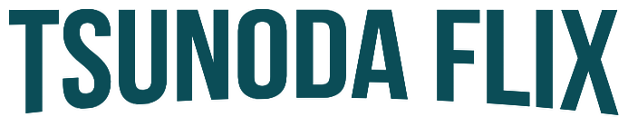

<p align="center">
 
</p>
<p align="center">
 
 
 
</p>

#### Este projeto foi criado com base na semana da imersão react da Alura. Ele visa criar uma versão alternativa da Netflix, já com a opção de cadastro de vídeos e categorias.

## Conhecimentos passados durante a imersão

- [X] Alguns Hooks do React (useEffect, useState)
- [X] Estilização com Styled Component
- [X] Componentização
- [X] Promises com Fetch
- [X] Criação de um hook form para reutilização 

## Requisitos de instalação

- React >= 16.13.*
- npm >= 6.0.0
- node >= 10

## Como utilizar

#### Acesse o diretório Web
```
cd web
```

#### Execute o comando para instalações de dependências:

```
npm install
```

#### Iniciar o projeto:
> Foi criado um arquivo db.json que simula um server com banco de dados.

```
npm run dev
```

